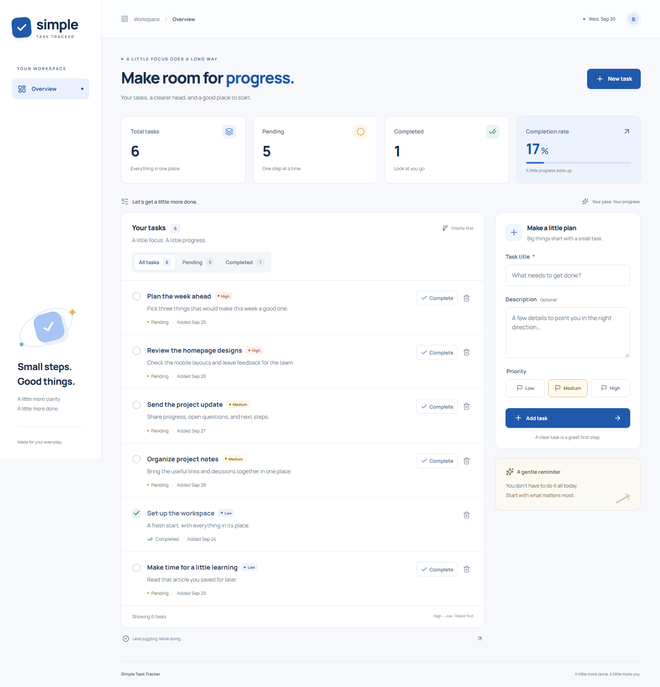

# Simple Task Tracker

A small, responsive task manager built with **React, TypeScript, vanilla PHP, and MySQL**. Create a task, choose a priority, finish it, and see your progress without reloading the page.



## Features

- Create tasks with a required title, optional description, and low/medium/high priority.
- List tasks by priority, then oldest creation time, using the standalone PHP sorter.
- Filter by all, pending, or completed tasks through the API.
- Complete tasks and delete them after confirmation, with AJAX updates.
- See global total, pending, completed, and completion-rate statistics, independent of the selected filter.
- Responsive layouts, keyboard controls, native confirmation dialog, reduced-motion support, and loading/error/empty states.
- MySQL persistence; refreshing the page keeps saved tasks. Sample data is optional.

## Requirements

- PHP **8.3+** with `pdo_mysql`, `mbstring`, `dom`, `xml`, and `xmlwriter` enabled.
- Composer 2.
- MySQL **8.0+** (tested with MySQL 8.4.11).
- Node.js **22.12+** and npm.

The verification environment used PHP 8.5.11, MySQL 8.4.11, and Node.js 24.15.0. XAMPP installations with PHP 8.0 are too old for these locked dependencies; use a supported PHP version.

## Setup

Run commands from the repository root.

### 1. Install dependencies

```sh
composer install
npm ci
```

### 2. Create the database and a local user

Connect to your MySQL instance as an administrator (`mysql -u root -p`) and run:

```sql
CREATE DATABASE task_tracker
    CHARACTER SET utf8mb4 COLLATE utf8mb4_unicode_ci;

CREATE USER 'task_tracker'@'127.0.0.1' IDENTIFIED BY 'choose-a-local-password';
GRANT SELECT, INSERT, UPDATE, DELETE, CREATE, INDEX
    ON task_tracker.* TO 'task_tracker'@'127.0.0.1';
```

`CREATE` and `INDEX` are needed for schema setup. A separately provisioned runtime user only needs the four CRUD permissions. If you already have an appropriate MySQL user, use its credentials instead.

### 3. Configure the connection

```sh
cp .env.example .env
```

In PowerShell, use `Copy-Item .env.example .env`. Edit `.env`:

```dotenv
DB_HOST=127.0.0.1
DB_PORT=3306
DB_DATABASE=task_tracker
DB_USERNAME=task_tracker
DB_PASSWORD=choose-a-local-password
```

The password must match the user you created. Use your actual port if it differs. `.env` is excluded from Git; database settings are never bundled into the frontend.

### 4. Create the table and build

```sh
composer db:setup
npm run build
```

Schema setup creates the table if absent and does not erase existing tasks. To add six example tasks to an **empty** database, optionally run:

```sh
composer db:seed
```

### 5. Run the application

```sh
composer serve
```

Open **http://127.0.0.1:8000**. This serves the built React application and PHP API from one origin. Keep the terminal open; `Ctrl+C` stops the server.

For frontend development, keep the PHP server running and open a second terminal:

```sh
npm run dev
```

Open **http://127.0.0.1:5173/build/**. Vite proxies `/api` requests to PHP on port 8000. Rebuild with `npm run build` to update the version served on port 8000.

### Troubleshooting

| Symptom                            | Check                                                                                  |
| ---------------------------------- | -------------------------------------------------------------------------------------- |
| `php` / `composer` not found       | Add your PHP/Composer installation to PATH, or invoke its full path.                   |
| `could not find driver`            | Enable `pdo_mysql` in the `php.ini` shown by `php --ini`.                              |
| Connection refused / access denied | Start MySQL; check port, database name, username, password, and the user's host grant. |
| API reports tasks unavailable      | Inspect the PHP terminal for the server-side error; confirm `composer db:setup` ran.   |
| Frontend build is missing          | Run `npm ci` and `npm run build`.                                                      |
| Port 8000 or 5173 already in use   | Stop the conflicting server or update the PHP command and Vite proxy together.         |

## API

All responses use JSON. Send `Content-Type: application/json` when creating a task.

| Method | Endpoint                    | Success | Behavior                                                                                |
| ------ | --------------------------- | ------- | --------------------------------------------------------------------------------------- |
| GET    | `/api/tasks`                | 200     | Sorted tasks and global statistics.                                                     |
| GET    | `/api/tasks?status=pending` | 200     | Pending tasks; also accepts `completed`. Omit the parameter for all tasks.              |
| POST   | `/api/tasks`                | 201     | Validate and create a pending task.                                                     |
| PATCH  | `/api/tasks/{id}/complete`  | 200     | Complete the task; repeated completion is safe and does not change its timestamp again. |
| DELETE | `/api/tasks/{id}`           | 200     | Delete an existing task.                                                                |

Invalid JSON, invalid fields, or invalid filters return **400**; missing tasks/routes return **404**; unsupported methods return **405** with an `Allow` header. Unexpected server errors return **500** with a generic message and are logged on the server.

Example creation body:

```json
{
  "title": "Review the project brief",
  "description": "Confirm the required endpoints and delivery format.",
  "priority": "high"
}
```

Creation/completion return `{ "data": { ...task } }`; deletion returns `{ "message": "Task deleted." }`. Listing returns:

```json
{
  "data": [],
  "statistics": { "total": 0, "pending": 0, "completed": 0 }
}
```

Titles must be strings containing non-whitespace text, up to 255 characters. Descriptions may be omitted or null, up to 5,000 characters. Priority defaults to `medium`; supplied values must be `low`, `medium`, or `high`. The server owns IDs, initial `pending` status, and timestamps. Responses use UTC ISO timestamps. Optional description whitespace is normalized to null.

## Structure and decisions

```text
src/
  TaskSorter.php       Standalone raw PHP sorting class
  TaskRepository.php   Prepared SQL statements and task serialization
  TaskValidator.php    Request validation and normalization
  Database.php         PDO connection from environment configuration
  JsonResponse.php     JSON status/body responses
  bootstrap.php        Autoload, environment, UTC
public/
  index.php            API dispatch and error handling
  router.php           Local HTTP routing; only built assets are served
frontend/
  App.tsx              Dashboard and task mutation coordination
  api.ts               Typed HTTP boundary and request errors
  useTasks.ts          List loading, refresh, cancellation, and errors
  components/          Task form, list, statistics, brand, confirmation
  styles/              Layout, forms, tasks, feedback, responsive rules
database/              Schema setup and optional seed
tests/                 PHPUnit and Playwright tests
docs/                  Review guide and verification notes
```

Vanilla PHP keeps the four endpoints easy to trace without adding a framework. PDO uses prepared statements and native parameter binding. React uses component state and one focused loading hook; no global state library is needed. Mutation feedback follows a successful server response, then the list and statistics are reloaded. Failed creation retains the draft. Aborted or outdated list requests cannot overwrite a newer filter result.

`App\TaskSorter` has no framework or Composer dependency when required directly. It accepts task arrays containing a valid priority and a PHP-parseable date string in `created_at`, including SQL timestamps and ISO timestamps with offsets. `usort` works on the local array copy; equal priority/date pairs retain input order on supported PHP versions. The repository retrieves rows in ID order to make exact ties deterministic.

There is deliberately no authentication, task editing, reopening, pagination, or external payment integration. This is a single shared task list matching the brief. The bundled PHP development server is for local review; an Internet deployment would need a production web server and access control appropriate to its audience.

## Tests and checks

```sh
composer test
composer lint
npm run typecheck
npm run lint
npm run format:check
npm run build
```

PHPUnit includes **three sorter tests** (priority, date ordering with timezone offsets, and empty/exact-tie behavior) plus three validation tests.

### API and browser tests

Create a separate test database with your MySQL administrator:

```sql
CREATE DATABASE task_tracker_test
    CHARACTER SET utf8mb4 COLLATE utf8mb4_unicode_ci;
GRANT SELECT, INSERT, UPDATE, DELETE, CREATE, INDEX
    ON task_tracker_test.* TO 'task_tracker'@'127.0.0.1';
```

Then run:

```sh
npx playwright install chromium
npm run build
npm run test:e2e
```

The test runner starts PHP on **8001**, overrides the database name to `task_tracker_test`, and creates its table. It refuses a test database name that does not end in `_test`. Tests create and clean up their own records. They use actual PHP/MySQL for the main flow; explicit network mocks cover loading and failure states.

If PHP is not on PATH, set `PHP_BINARY` to its full executable path. To use another isolated database, set `TEST_DB_DATABASE` to a name ending in `_test`. The host, port, and credentials come from `.env` or your environment. The test runner stops its server on completion. Reports are generated under `playwright-report/`; screenshots and traces are excluded from Git.

The suite covers persistence, filtering, sorting, idempotent completion, deletion, invalid input, error recovery, empty/loading feedback, keyboard cancellation, automated accessibility, and widths **320, 375, 390, 414, 768, 1024, and 1280px**. See [verification notes](docs/VERIFICATION.md) for results and limits.

## AI Disclosure

**Tool used:** OpenAI Codex in the local development workspace (ChatGPT/OpenAI coding assistant). No claim is made that other AI tools were used.

**AI-assisted/generated work:** Codex assisted with requirements analysis, architecture, the initial PHP sorter/API/schema, React/TypeScript components, styling, tests, build configuration, documentation, and Git commits. The assistance covered substantially the whole initial implementation, not just isolated snippets. Earlier public-site research informed visual decisions; no proprietary company code or private infrastructure was accessed.

**Review and corrections during the AI-assisted session:** The implementation was exercised against actual MySQL and reviewed with PHPUnit, PHP_CodeSniffer, TypeScript, ESLint, browser tests, and accessibility checks. Corrections included dependency compatibility, PHP namespaces and response organization, a font import, test label matching, contrast adjustments, keyboard focus after task actions, responsive control styling, and reading test database settings when PHP does not populate `$_ENV`. Validation tests check blank/invalid input; browser tests check persistence, recovery, and destructive-action confirmation. The final source was formatted and its CSS separated by responsibility for review. These actions were performed with AI assistance; they are not represented as independent human review.

**Candidate responsibility:** The candidate must personally read, understand, and be able to modify the submitted code. This README does not assert that the candidate has already completed that review. [The review guide](docs/REVIEW_GUIDE.md) explains the data flow and suggests concrete exercises. Before submitting, complete that review and add an honest record of any personal changes or fixes here. Do not claim work you did not perform.
