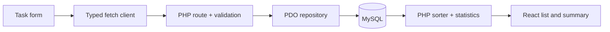

# Understanding and defending the implementation

This is a reading guide, not a substitute for reviewing the code. Follow the functions in the editor and run the exercises yourself before submission.

## Follow one task from the form to MySQL

1. `TaskForm.tsx` keeps the three editable fields in local React state. Submission prevents a browser navigation, checks a blank title, and waits for `onCreate`. The draft is only cleared after success.
2. `App.tsx` calls `tasksApi.create`, shows feedback, and asks `useTasks` to refresh.
3. `api.ts` sends JSON to `/api/tasks`. Failed HTTP responses become `ApiError` objects; a timeout prevents an indefinitely waiting request.
4. `public/index.php` matches the route/method, parses the JSON object, and calls `TaskValidator` before opening the database connection.
5. `TaskRepository::create` inserts bound values using PDO. SQL defaults provide status and timestamps. The row is read back and returned with a 201 response.
6. `useTasks` loads the selected filter and global statistics. Its abort controller cancels old requests when the filter changes or the component unmounts.
7. React renders the persisted result. Refreshing the browser retrieves it again from MySQL, not local storage.

## Explain the sorter

High maps to 0, medium to 1, and low to 2. The comparator first compares those ranks with PHP's spaceship operator. Only equal ranks reach the date comparison. `DateTimeImmutable` compares actual instants, including timezone offsets. The result is a reindexed array; the caller's original array is unchanged. Equal keys remain stable in PHP 8+. The database's initial ID order gives a predictable result for exact ties.

The sorter expects valid priorities and parseable date strings. HTTP creation validation plus database enums/timestamps uphold that contract. It does not silently invent priorities for malformed standalone input. Sorting is O(n log n); fetching all tasks is acceptable for this lightweight brief, but pagination and database-side ordering would be appropriate for a larger dataset.

## Explain the API choices

- **201** means a task was created; **200** means a read/update/delete succeeded.
- **400** is used for invalid input as requested by the rubric; the project does not adopt Laravel's usual 422 validation response.
- Missing task IDs return **404**. Completing a previously completed task succeeds without changing its update timestamp again.
- Prepared statements separate user data from SQL syntax. React renders task strings as text instead of inserting HTML.
- `status`, IDs, and timestamps are controlled by the server. A supplied `status` does not let a client create an already completed task.
- Empty descriptions become null. The text-length limits are explicit application constraints.
- Database errors are logged in PHP; responses avoid exposing credentials or SQL details.
- The frontend and API share an origin in the built application. The Vite proxy provides that behavior in development, so broad CORS permissions are unnecessary.

## Explain the UI choices

- Status and priority have visible text as well as color.
- Filters are pressed-state buttons, not tabs pretending to navigate to separate pages.
- Statistics remain global so their meaning does not change when a filter changes.
- The delete dialog is a native `dialog`; it moves focus to the safe action and supports Escape. A pending delete cannot be dismissed mid-request.
- The form stays intact after server errors. Rows are not optimistically removed before the server confirms deletion.
- Mobile changes the layout, field sizing, and action placement. Long unbroken titles wrap instead of forcing horizontal scrolling.
- The stylesheet entry imports files by responsibility. Shared colors, radii, and components keep the page consistent without a UI framework.

## Try these changes yourself

1. Explain why two high-priority tasks reverse order when their creation dates change. Add a sample input and predict the output before running it.
2. Change the default priority to low. Identify the frontend, validator, database default, and tests affected.
3. Add a maximum of 200 title characters. Explain why both the client and server need updates, and how the database column relates to that limit.
4. Simulate a network failure. Verify that a form draft survives and the list offers retry.
5. Add an endpoint to reopen a task on a separate practice branch. Explain its HTTP method, validation, state transition, response, UI affordance, and tests.
6. Explain what must change before several authenticated users can have private lists. The current app intentionally has no accounts or ownership model.

Record personal review and actual changes in the README's disclosure before submitting. Do not invent a review history or claim these exercises are already complete.
